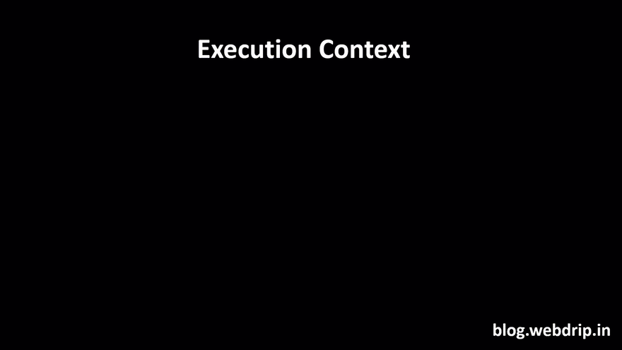
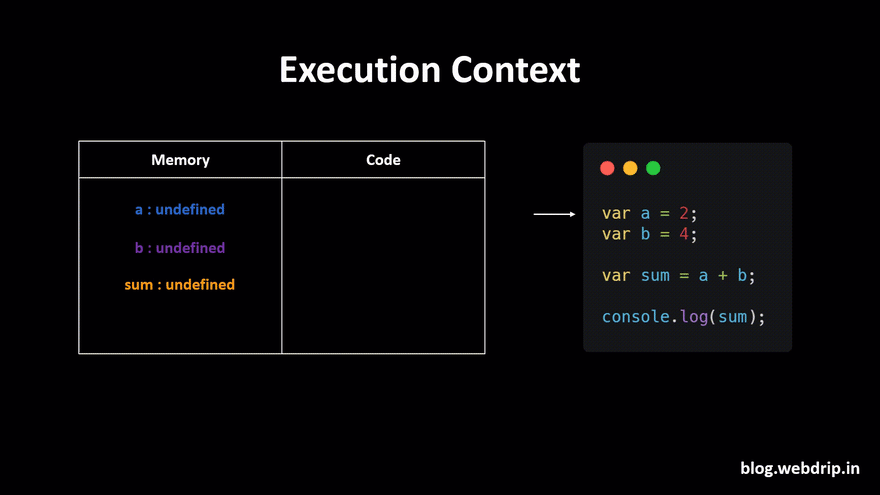
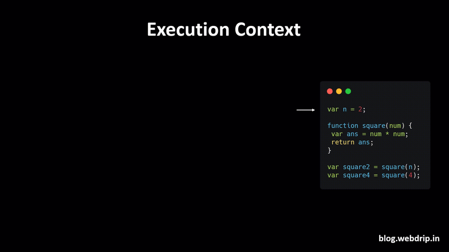
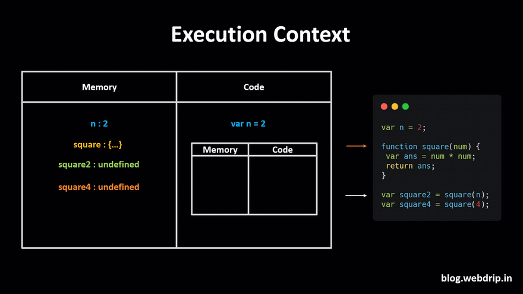
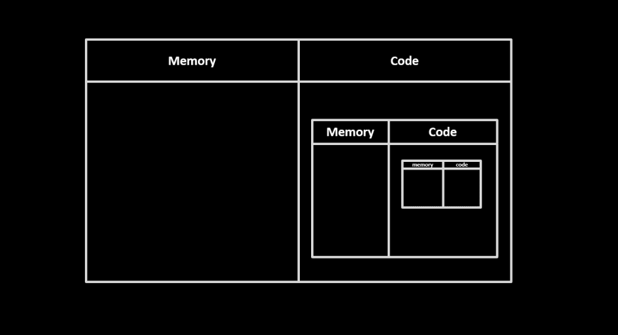
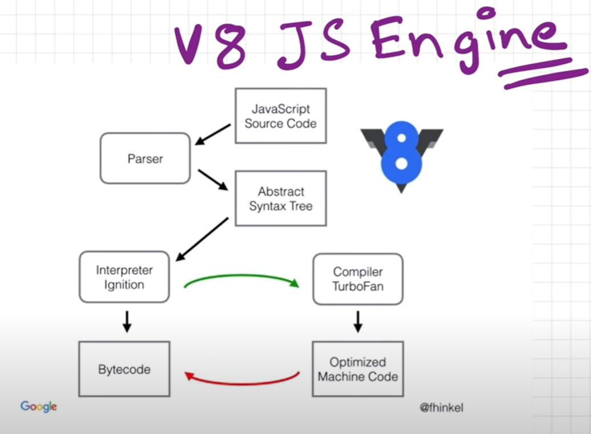

# Javascript

JavaScript is a synchronous, single-threaded language. It is because it can only execute one command at a time and in a specific order.

## Let vs Var vs Const

Let and const are block scoped, while var is function scoped. This means that if you declare a variable with let or const inside a block, such as an if statement, the variable will only be accessible to the code within the curly braces. If you use var, the variable is accessible to the entire function.

````javascript
function doSomething() {
  for (var i = 0; i < 5; i++) {
    console.log(i);
  }

  console.log('Finally: ' + i); // 5
}
```

## Execution Context

Everything in JavaScript happens inside an Execution Context.

- Memory component (Memory creation phase)
  - Memory component is also known as variable environment. In this memory component, variables and functions are stored as key-value pairs
- Code component (Code Execuation phase)
  - Code component is a place in the container where code is executed one line at a time. This code component also has a fancy name, namely 'Thread of Execution'.


### Variables

Let's take a simple example,

```javascript
var a = 2
var b = 4

var sum = a + b

console.log(sum)
````



The browser creates a global execution context with two components, namely memory and code components.

The Browser will execute the JavaScript code in two-phases

1- Memory Creation Phase

2- Code Execution Phase

In the memory creation phase, JavaScript will scan through all the code and allocate memory to all the variables and functions in the code. For variables, JavaScript will store undefined in the memory creation phase, and for functions, it will keep the entire function code, which we will be looking at the following example.



Now, in the 2nd phase, i.e. code execution, it starts going through the whole code line by line.

As it encounters var a = 2, it assigns 2 to 'a' in memory. Until now, the value of 'a' was undefined.

Similarly, it does the same thing for the b variable. It assigns 4 to 'b'. Then it calculates and stores the value of the sum in memory which is 6. Now, in the last step, it prints the sum value in the console and then destroys the global execution context as our code is finished.

### How Functions Are Called In Execution Context?

Functions in JavaScript, when you compare with other programming languages, work differently.

Let's take a simple example,

```javascript
var n = 2;

function square(num) {
  var ans = num \* num;
  return ans;
}

var square2 = square(n);
var square4 = square(4);
```

The above example has an function which takes an argument of type number and returns the square of the number.

JavaScript will create a global execution context and allocate memory to all the variables and functions in the first phase when we run the code, as shown below.

For functions, It will store the entire function in the memory.



Here comes the exciting part, When JavaScript runs functions, it will create an execution context inside the global execution context.

As it encounters var a = 2, it assigns 2 to 'n' in memory. Line number 2 is a function, and as the function has been allocated memory in the memory execution phase, it will directly jump to line number 6.

square2 variable will invoke the square function, and javascript will create a new execution context.


This new execution context for the square function will assign memory to all the variables present in the function in the memory creation phase.



After assigning memory to all the variables inside the function, it will execute the code line by line. It will get the value of num, which is equal to 2 for the first variable and then it will calculate ans. After ans has been calculated, it will return the value which will be assigned to square2.

Once the function returns the value, it will destroy its execution context as it has completed the work.


Now it will follow a similar procedure for line number 7 or square4 variable, as shown below.


Once all the code is executed, the global execution context will also be destroyed, and this is how JavaScript will execute the code behind the scene.

## Call Stack (main thread)

When a function is invoked in JavaScript, JavaScript creates an execution context. Execution context will get complicated as we nest functions inside a function.



JavaScript manages code execution context creation and deletion with the the help of Call Stack.

A stack (sometimes called a “push-down stack”) is an ordered collection of items where the addition of new items and the removal of existing items always takes place at the same end eg. stack of books.

Call Stack is a mechanism to keep track of its place in a script that calls multiple functions — what function is currently being run and what functions are called from within that function,

Let's take an example

```javascript
function a() {
  function insideA() {
    return true
  }
  insideA()
}
a()
```

We are creating a function 'a', which calls another function 'insideA' that returns true. I know the code is dumb and doesn't do anything, but it will help us understand how JavaScript handles callback functions.


JavaScript will create a global execution context. Global execution context will assign memory to function 'a' and invoke' function a' in the code execution phase.

An execution context is created for function a, which is placed above the global execution context in the call stack.

Function a will assign memory and invoke function insideA. An execution context is created for function insideA and placed above the call stack of 'function a'.

Now, this insideA function will return true and will be removed from the call stack.

As there is no code inside 'function a' execution context will be removed from the call stack.

Finally, the global execution context is also removed from the call stack.

# Hoisting

The process whereby the interpreter allocates memory for variable and function declarations prior to execution of the code and moving just the declarations to the top of the code. This allows variables to appear in code before they are defined.

> 📝 However, that any variable initialization in the original code will not happen until the line of code is executed.

> 📝 JavaScript only hoists declarations, not initializations.

```javascript
console.log(num) // Returns 'undefined' from hoisted var declaration (not 6)
var num // Declaration
num = 6 // Initialization
```

```javascript
console.log(num) // ReferenceError: num is not defined
num = 6 // Initialization (because only has initialization)
```

```javascript
Temporal Dead Zone (TDZ) (the time between the let OR const was hoisted to the time their initialization)
console.log(num) // ReferenceError: Cannot access 'num' before initialization
let num = 6 // hoisted but no default value of undefined
const num = 6 // hoisted but no default value of undefined
```

```javascript
console.log(typeof i) // ReferenceError
let i = 10
console.log(typeof undeclaredVariable) // Prints undefined
```

```javascript
hoisted() // logs "foo"

// function declaration
function hoisted() {
  console.log("foo")
}

notHoisted() // TypeError: notHoisted is not a function

// function expressions
var notHoisted = function () {
  console.log("bar")
}
```

```javascript
var x = 0 // Declares x within file scope, then assigns it a value of 0.

console.log(typeof z) // "undefined", since z doesn't exist yet

function a() {
  var y = 2 // Declares y within scope of function a, then assigns it a value of 2.

  console.log(x, y) // 0 2

  function b() {
    x = 3 // Assigns 3 to existing file scoped x.
    y = 4 // Assigns 4 to existing outer y.
    z = 5 // Creates a new global variable z, and assigns it a value of 5.
    // (Throws a ReferenceError in strict mode.)
  }

  b() // Creates z as a global variable.
  console.log(x, y, z) // 3 4 5
}

a() // Also calls b.
console.log(x, z) // 3 5
console.log(typeof y) // "undefined", as y is local to function a
```

### Variables

- Declarations that are made using **var** are initialized with a default value of **undefined**.
- Declarations that are made using **let** and **const** are not initialized as part of hoisting.
- All let, var & const are hoisted but let & const are in Temporal Dead Zone. (var will be in GLOBAL state but let & const will be in Script state in chrome browser & u can't use let & const variables before their initialization)
- let and const are block scoped while var is Global scoped

### Functions

- Put functions (normal functions) as whole (function body) in memory.
- Deal arrow functions as normal variables and assign undefine in memory. (means function expressions are not hoisted)

### Advantages:

- Functions can be used before you declare it in your code.
- Variables can be used before you declare it in your code.

## Window & this

Global variable representing the window in which script is running. It is initialized alongside the Global Execution Context by the Javascript Engine.

On global level

```javascript
this === window
```

## Undefined vs not defined vs null

### Not defined (a state of something)

If a variable is accessed before defining then JS will show it as not defined

### Undefined (mutable)

if a variables is defined but not initialized I.e. no values is assigned to it before accessing, then its undefined.

### Null (non-mutable)

An object with a valid non-existence value;

# Scope Chain & Lexical Environment

## Lexical Environment

The Local memory and Lexical environment of it's parent.

## Scope Chain

The combination of all the lexical environments

## Block

A group of statements. Block is also known as compound statement

## Shadowing & Illegal Shadowing

When shadowing, the variable should not cross it's boundary. (like var initialized inside block is in global)

```javascript (Shadowing)
let a = 10
var b = 20
const c = 30
var d = 40
{
  // block
  let a = 20
  var b = 30
  const c = 40
  let d = 50
}
```

```javascript (Shadowing)
let a = 10
function x() {
  // boundary
  var a = 100
}
```

```javascript (Illegal Shadowing)
let a = 10
{
  // block
  var a = 100
}
```

# Closure

- function + lexical environment
- A combination of a function bundled together with it's lexical environment
- A closure gives you access to an outer function’s scope from an inner function.
- In JavaScript, closures are created every time a function is created, at function creation time.

```javascript
function x() {
  var a = 10
  function y() {
    console.log(a)
  }
  return y
}
const z = x()
console.log(z)
z() // how will z (that is y function) finds the value of a to log it's value? This is closure. It means when they are returned, they still contain their lexical scope. Here a value
```

## Uses of Closures

- Module Design Pattern
- Currying
- Functions like once
- memoize
- maintaining state in async world
- setTimeouts
- Iterators
- Data hiding & Encapsulation
  and many more

  ```javascript
  const callOnce = (fn, i=0, memo) => () => i++ ? memo : (memo = fn());
  // usage
  const myExpensiveFunction = () => { return console.log('joe'),5; }
  const memoed = callOnce(myExpensiveFunction);
  memoed(); //logs "joe", returns 5
  memoed(); // returns 5
  memoed(); // returns 5
  ...
  ```

  ```javascript
  function x() {
    for (let i = 1; i <= 5; i++) {
      setTimeout(function () {
        console.log("i", i)
      }, 1000)
    }
  }
  x() // 1,2,3,4,5
  ```

  ```javascript
  function x() {
    for (var i = 1; i <= 5; i++) {
      setTimeout(function () {
        console.log("i", i)
      }, 1000)
    }
  }

  x() // 6,6,6,6,6

  function x() {
    for (var i = 1; i <= 5; i++) {
      function closure(i) {
        setTimeout(function () {
          console.log("i", i)
        }, i * 1000)
      }
      closure(i)
    }
  }

  x() // 1,2,3,4,5
  ```

## Disadvantages

- Memory over-consumption (the variables at upper levels are not garbage collected)
- Can lead to memory leak if not properly handled

# Function statement & Function declaration

```javascript
a() // Hoisted and can be called
function a() {}
```

# Function expression

```javascript
a() // Hoisted by undefined and can't be called (a is not a function)
var a = function () {}
```

# Anonymous Functions

- A function with no name
- An anonymous functions are when functions are used as values.

```javascript
var a = function () {}
```

# Named Function Expression

```javascript
var a = function b() {}
```

# First class Functions (Functions as First class citizens)

The ability to treat functions like any other variable when a function can be passed as an argument to other functions, can be returned by another function and can be assigned as a value to a variable.

# Parameters vs Arguments

```javascript
function a(num1, num2) {} // parameters num1 & num2
a(1, 2) // arguments 1 && 2
```

# Pure Functions

The functions that do not depend on external factors. The output will clearly and fully dependent on the input and will always return the same output for the same input. It does not depend on any state or data change during a program’s execution. Rather, it only depends on its input arguments.

```javascript
function calculateGST(productPrice) {
  return productPrice * 0.05
} // will always return 5% of the product price (same value for a same input)
```

# Callback Functions

A callback function is a function passed into another function as an argument

# Garbage collection

- Freeing up the memory (deleting variables, removing event listeners) when not needed.
- Garbage collector is a program which frees up the unutilized memory.

```javascript
// Relation of garbage collection with closure
function a() {
  var x = 10,
    y = 100
  return function () {
    console.log(x) // At this point of time, y will be garbage collected (removed from the memory) because it's not being used while x will stay in closure with return function and stays in memory
  }
}
var z = a()
// some hunders or thousands of lines
z() // logs 10
```

## Mark & Sweep Algorithm



## Orinoco

## Oil Pam

# What is V8

## Inlining

## Copy elision

## Inline Caching

# Event loop

- The job of the event loop is to check the callback queue and put the callback functions into the call stack
- It's like a gatekeeper between callback queue and call stack and keeps on checking for callbacks to put them into call stack

## Event loop Phases

## Macro/Micro Tasks of Event Loop

## Strategies to use event loop functionality

- setTimeout - 0
- Batching your works (Big array to chunks, batch processing)
- Web workers

# Blocking vs non-blocking

# Microtask queue

- Higher priority
- Callbacks functions from promises/mutation observers callback

# Callback queue ( Task queue, Event queue )

- Lower Priority
- Callbacks functions from setTimeout

# Memory heap

# Mutation observer

# Starvation of callback queue

- When the callbacks inside callback queue don't get a chance to be executed because of large number of callbacks in microstask queue

# Javascript Runtime Environment

## Just in time compilation (JIT)

- Optimize the code at much as it can at runtime

# Interpreter

- Execute code line by line
- Fast

# Compiler

- Convert code to optimized version and then execute it
- Efficiency

# Streams & Duplex streams

# Concurrency Model

# Data hiding & Encapsulation

- Some functions don't have access to some variables
- Encapsulate data so other part of program can't access it.

```javascript
function counter() {
  var count = 0 // Private (Hidden from outside)
  function increment() {
    count++
  }
}
console.log(count) // ReferenceError: count is not defined

function counter() {
  var count = 0
  this.incrementCounter = function () {
    return ++count
  }
  this.decrementCounter = function () {
    return --count
  }
  this.getCount = function () {
    return count
  }
}

let counter1 = new counter()
console.log(counter1.getCount())
console.log(counter1.incrementCounter())
console.log(counter1.decrementCounter())
```

# Prototyping

```javascript
const arr = [1,2,4,5]

Array.prototype.iterate = function () => {
  return this;
}

console.log(arr.iterate())
```

# Inheritance

One object trying to access the properties of an other object

# Prototypal Inheritance

```javascript
const obj = {
  name: "talha",
  age: 23,
  getIntro: function () {
    return this.name + this.age + this.city
  },
}
const obj2 = { name: "ahmed", city: "lahore" }
// Never do this
obj2.__proto__ = obj

// we can access the obj through obj2
console.log(obj2.age) // 23
console.log(obj2.name) // ahmed
console.log(obj.getIntro()) // talha23undefined
console.log(obj2.getIntro()) // ahmed23lahore
```

# `this` in arrow function & normal function

- In the regular function, a function always defines its this value. Arrow functions treat this keyword differently. They don’t define their own context since it doesn’t have its own this context. They inherit that from the parent scope whenever you call this.

```javascript
const parent = {
  name: "Talha Ahmad",
  name_1: () => {
    return `${this.name} is my name.`
  },
  name_2: function () {
    return `${this.name} is my name.`
  },
}
console.log(parent.name_1()) // undefined is my name.
console.log(parent.name_2()) // Talha Ahmad is my name.
```

# Higher-order function (HOF)

- A Higher-order function is a function that takes a function or returns a new function.

## Promises

## async/await

## Webworkers

- To run/execute code on a new thread
- Does not run in window context
- Does not have access to the DOM
- Use method postMessage to communicate between threads (web workers)
- Use event listener onMessage to receive messages from other threads (web workers)

## CLASS

- Class is a template or a blueprint for an object that encapsulates data with code to work on that data.
- Class contains different methods and properties and follows strict formatting.
- Class is not hoisted means you need to initiate/declare the class before using it.
- Static methods/properties in a class will be used without instantiating the class and cannot be called through the class instance.
- Private instance fields are declared with #names (called hash names)
